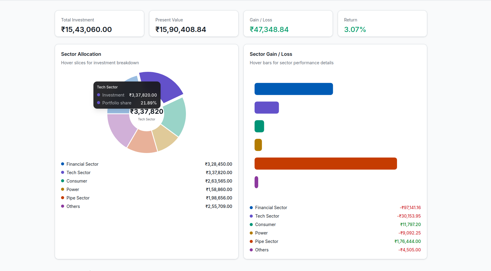

# Portfolio Dashboard

Dynamic portfolio dashboard for the **Octa Byte AI** case study. Monorepo with a React frontend, Express API, Sequelize/SQLite persistence, and live market data from unofficial Yahoo Finance and Google Finance sources.


## Preview



Dashboard overview showing total investment, present value, sector allocation (pie chart), and sector gain/loss (bar chart) with 15-second live market data refresh.

## Stack

| Layer | Technology |
|-------|------------|
| Monorepo | [Turborepo](https://turbo.build/) + pnpm workspaces |
| Frontend | React 19, Vite, TypeScript, Tailwind CSS v4, [shadcn/ui](https://ui.shadcn.com/) |
| Tables | [@tanstack/react-table](https://tanstack.com/table) |
| Charts | Sector allocation & gain/loss visualizations (bklit-ui compatible; see below) |
| Backend | Express 5, Sequelize, SQLite |
| Market data | `yahoo-finance2` (CMP), Google Finance HTML scrape (P/E, EPS) |

## Project structure

```
apps/
  api/     Express + Sequelize API (port 4000)
  web/     React dashboard (port 5173)
packages/
  shared/  Shared TypeScript types
```

## Prerequisites

- Node.js 20+
- pnpm 10+

## Deploy on Vercel (frontend + serverless API)

Both apps deploy from one Vercel project. Portfolio holdings live in a **committed SQLite file** at `apps/api/data/portfolio.db` (no build-time seeding on Vercel).

### One-time / when holdings change

```bash
pnpm db:seed   # regenerates apps/api/data/portfolio.db
git add apps/api/data/portfolio.db
git commit -m "Update portfolio database"
```

### Vercel project settings

| Setting | Value |
|---------|--------|
| **Framework** | Other |
| **Build Command** | `pnpm vercel-build` (or use `vercel.json`) |
| **Output Directory** | `apps/web/dist` |
| **Install Command** | `pnpm install` |

Push to GitHub — Vercel picks up `vercel.json` automatically. API routes hit `/api/portfolio` via the serverless function in `/api`.

### How it works

- `apps/web/dist` — static React app  
- `api/index.ts` — Express API as a serverless function  
- `apps/api/data/portfolio.db` — bundled with the function via `includeFiles` in `vercel.json`  

On Vercel, the `.db` file is copied to `/tmp` on cold start (serverless filesystem is read-only elsewhere).

## Setup (local)

```bash
# Install dependencies (allows native sqlite3 build)
pnpm install

# Seed SQLite from case study Excel holdings (auto-seeds on first API start)
pnpm db:seed

# Run API + web together
pnpm dev
```

Or run apps separately:

```bash
pnpm --filter @portfolio/api dev   # http://localhost:4000
pnpm --filter @portfolio/web dev   # http://localhost:5173
```

Open **http://localhost:5173**. The Vite dev server proxies `/api` to the backend.

## Features

- Portfolio table with all required columns from the case study Excel
- **CMP** from Yahoo Finance (`SYMBOL.NS` / `CODE.BO`)
- **P/E ratio & latest earnings** from Google Finance
- Auto-refresh every **15 seconds**
- Green/red gain-loss indicators
- Sector grouping with investment, present value, and gain/loss summaries
- In-memory caching, throttled requests, stale-cache fallback, Excel-seeded fallbacks
- Disclaimer for unofficial/delayed data

## Bklit UI charts (optional upgrade)

This project includes working sector charts styled for the dashboard. To add official [Bklit UI](https://github.com/bklit/bklit-ui) chart components:

```bash
cd apps/web
# components.json already includes the @bklit registry
pnpm dlx shadcn@latest add @bklit/pie-chart @bklit/bar-chart
```

See [Bklit installation docs](https://ui.bklit.com/docs/installation).

## API

| Endpoint | Description |
|----------|-------------|
| `GET /api/portfolio` | Full portfolio with live quotes and sector summaries |
| `GET /api/portfolio/health` | Health check |

## Data disclaimer

Yahoo Finance and Google Finance do not provide official public APIs for this use case. This app uses unofficial libraries and HTML scraping with caching and validation. Prices may be delayed or inaccurate — not financial advice.

## License

MIT — case study submission for Octa Byte AI Pvt Ltd.
